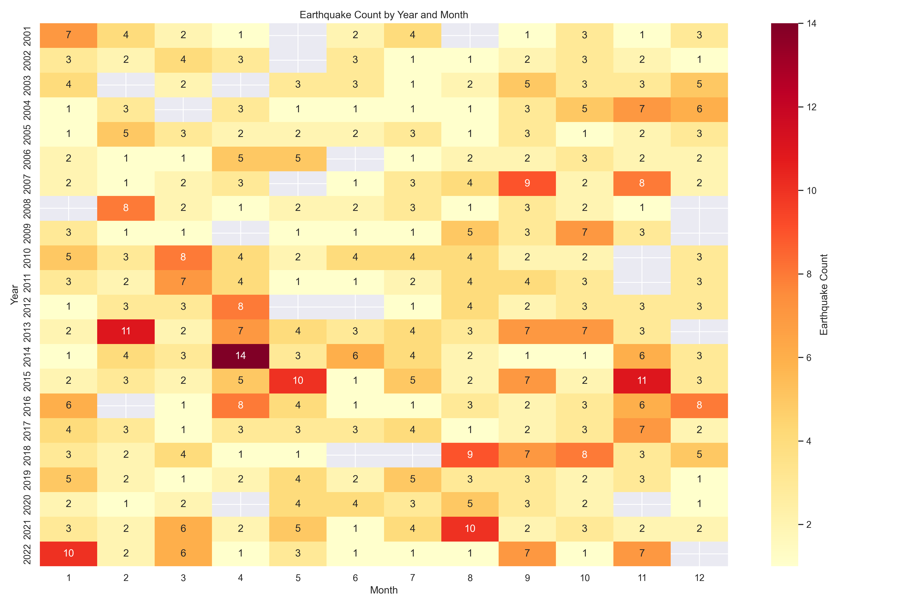

# Data Analysis Projects: 8 End-to-End EDA Case Studies

> **Cleaning messy real-world data, optimizing memory, and storytelling with data.** 8 complete Kaggle analyses (150k+ rows) focused on EDA, data wrangling, and visualization for Data Analyst / Data Scientist roles.

[](https://python.org)
[](#)
[](#)
[](#)
[](#)
[](#featured-projects)

### At a Glance

| What | Details |
|---|---|
| **Domains** | Seismology, Health & Fitness, Microbiology/AMR, Agriculture, Real Estate, Energy Economics, Insurance, Manufacturing |
| **Scale** | ~150k rows combined · Gokak Crop Survey 113k rows, Life Habits 20k × 54 |
| **Stack** | `Python` · `pandas` / `polars` · `numpy` · `matplotlib` · `seaborn` · `scipy` |
| **Focus** | EDA (8/8) · Data Wrangling · Geospatial & Temporal Analysis · Memory Optimization · Statistical Regression |
| **Note on ML** | No formal ML modeling — one notebook (07 Caravan) includes only a baseline `RandomForest`/`LogisticRegression` trial for learning; core strength is EDA |

---

## Featured Projects

| # | Project | Domain | Dataset | What I Did | Key Insight | Links |
|---|---|---|---|---|---|---|
| **01** | **Earthquake & Tsunami Risk** | Seismology | 782 global quakes (2001-2022) | EDA, `pivot_table` Year×Month heatmaps, geo scatter (`lon/lat` sized by `mag²`), correlation | 304/782 tsunami-positive; heatmaps show seasonal clusters; Ring-of-Fire majors isolated | [Notebook](solutions/01_earthquake_analysis/earthquake.ipynb) · [Data](datasets/01_earthquake/) |
| **02** | **Life Habits & Fitness** | Health | 20k × 54 | 39-col correlation matrix (`viridis`), `displot`/`kde`, skew audit, engineered `pct_HRR`/`protein_per_kg` | `Burns Calories` skew -3.9 → outliers; macro-calorie correlations validated | [Notebook](solutions/02_lifehabits_analysis/lifehabits.ipynb) · [Data](datasets/02_life_habits/) |
| **03** | **Multidrug Resistance (AMR)** | Microbiology | 10.7k → 9.7k clean | **60% cleaning**: PII drop, `str.split`, `E.coi→E.coli` typo fix, `?/missing→NaN`, `s→S` recode, `catplot`/`violin` | E.coli 5,949 dominant; Beta-lactams most resistant | [Notebook](solutions/03_antibiotics_analysis/03_antibiotics.ipynb) · [Data](datasets/03_antibiotics/) |
| **04** | **Gokak Crop Survey** | Agriculture | 113k rows | Unit conversion `acres-cents.gunthas → total_acre`, `category`/`int16` **-73% memory**, `groupby` | **Sugarcane-P >35k acres** (166k total); June peak = Kharif season | [Notebook](solutions/04_cropsurvey_analysis/04_cropsurvey.ipynb) · [Data](datasets/04_cropsurvey/) |
| **05** | **Melbourne Housing** | Real Estate | 13.5k sales | **`polars`** pipeline (`group_by`, `str.to_date`), `boxplot`/`violin`/`scatter`, trend lineplot | House price variance widest; CBD distance-decay: `Price/Room` drops sharply from centre | [Notebook](solutions/05_melborune_analysis/melb.ipynb) · [Data](datasets/05_melborune_houses/) |
| **06** | **Global Petrol Prices** | Energy Economics | 101 countries | `read_excel`, `violin+stripplot` by Region, `pivot` heatmap, ranking bars | Europe most volatile Rising; gap >$6/L cheapest vs most expensive | [Notebook](solutions/06_petrol_analysis/06_petrol.ipynb) · [Data](datasets/06_petrol/) |
| **07** | **Caravan Insurance** | Insurance | 9.8k × 87 | **EDA-focused** + *introductory* baseline trial (`RandomForest`/`LogisticRegression`) — no tuning, kept for learning | EDA on 85 predictors; baseline showed 93% accuracy misleading (F1 0.09 on minority) — lesson on imbalance | [Notebook](solutions/07_caravan_insurance_analysis/07_caravan_analysis.ipynb) · [Data](datasets/07_caravan_insurance/) |
| **08** | **Manufacturing Kinetics** | Chemical | 7.5k × 23 | `scipy.linregress` Arrhenius (`ln k vs 1/T`), `kde` grid, cost by `machine_id` | Derived activation energy slope `-Ea/R`; M05 highest cost | [Notebook](solutions/08_manufacturing_analysis/analysis.ipynb) · [Data](datasets/08_manufacturing/) |

<details>
<summary><b>What recruiters see in 30 seconds — click to expand</b></summary>

*   **For EDA + Storytelling:** Start with **01, 05, 06** — publication-ready `seaborn` (heatmaps, violins, scatters with `alpha 0.5`).
*   **For Data Engineering:** See **03 & 04** — real dirty data + dtype optimization (-73%).
*   **For Statistical Rigor:** See **08** — fitting `ln k = ln A - Ea/RT`, not just plotting.

</details>

---

## Skills Demonstrated

| Category | Evidence |
|---|---|
| **Data Wrangling** | Mixed dates, multilingual text, typos, `drop_duplicates` 1,399 rows |
| **EDA & Stats** | `corr`/`skew`/`duplicated`, 39×39 matrix, temporal/geo trends |
| **Visualization** | 20+ `seaborn` types: heatmap, `relplot col_wrap`, `catplot`, `stripplot`, lollipop |
| **Engineering** | `polars`, `int16`/`category` memory cut (-73%), feature engineering |
| **Statistical** | Arrhenius linear regression (`scipy`), not ML |

---

## Repository Structure

```
kaggle/
├── datasets/                          # Raw Kaggle data (8 domains)
│   ├── 01_earthquake/                 # 782 quakes, tsunami label
│   ├── 02_life_habits/                # 20k × 54 lifestyle
│   ├── 03_antibiotics/                # 10.7k AMR records
│   ├── 04_cropsurvey/                 # 113k Gokak survey
│   ├── 05_melborune_houses/           # 13.5k Melbourne sales
│   ├── 06_petrol/                     # 101 countries petrol
│   ├── 07_caravan_insurance/          # 9.8k × 87 insurance
│   └── 08_manufacturing/              # 7.5k kinetics
├── solutions/                         # Jupyter notebooks (EDA → insights)
│   ├── 01_earthquake_analysis/earthquake.ipynb
│   ├── 02_lifehabits_analysis/lifehabits.ipynb
│   ├── 03_antibiotics_analysis/03_antibiotics.ipynb
│   ├── 04_cropsurvey_analysis/04_cropsurvey.ipynb
│   ├── 05_melborune_analysis/melb.ipynb
│   ├── 06_petrol_analysis/06_petrol.ipynb
│   ├── 07_caravan_insurance_analysis/07_caravan_analysis.ipynb
│   └── 08_manufacturing_analysis/analysis.ipynb
└── README.md
```

---

## Visual Highlights

| Earthquake Heatmaps | Crop Dominance |
|---|---|
|  |  |

*All notebooks render inline on GitHub. For large files use [nbviewer](https://nbviewer.org/).*

---

## Quick Start

```bash
# 1. Clone
git clone https://github.com/vishnutg14/data-analysis-projects.git
cd data-analysis-projects

# 2. Environment (pick one)
python -m venv .venv && source .venv/bin/activate  # or conda create -n kaggle python=3.11
pip install numpy pandas polars matplotlib seaborn scipy scikit-learn jupyter openpyxl

# 3. Run
jupyter lab
# open any solutions/*/ *.ipynb
```

Datasets are already in `datasets/` — no Kaggle API key needed. Sources credited inside each notebook.

---

## Author

**Vishnu T G** — Data Analysis
GitHub: [@vishnutg14](https://github.com/vishnutg14)